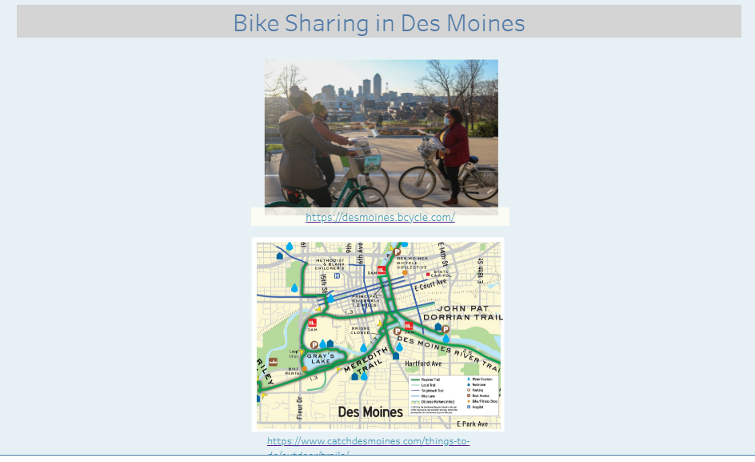
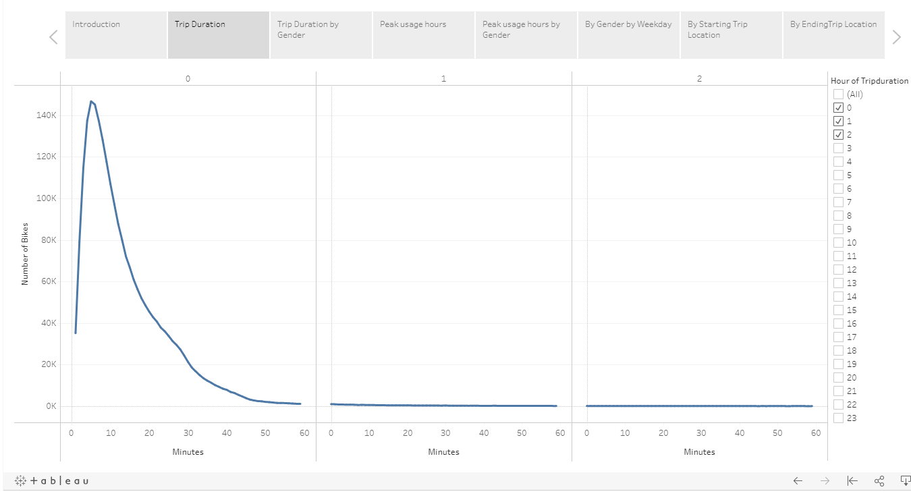
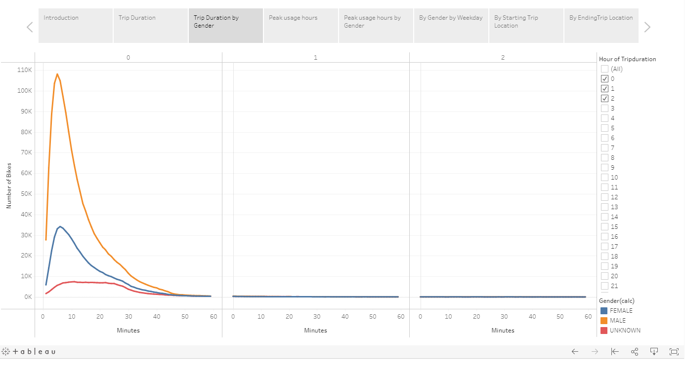
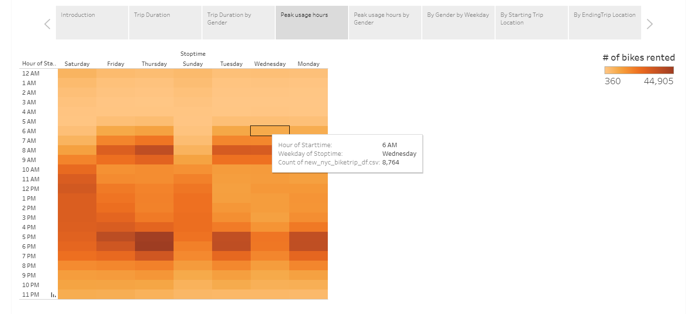
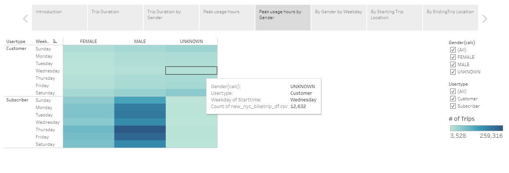
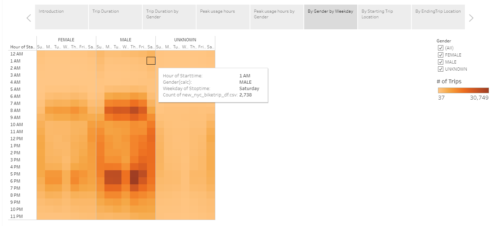
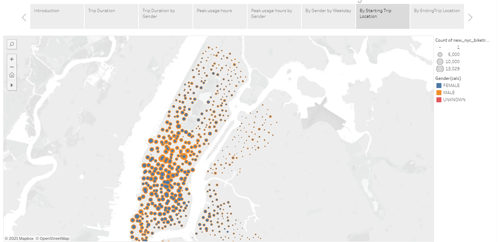
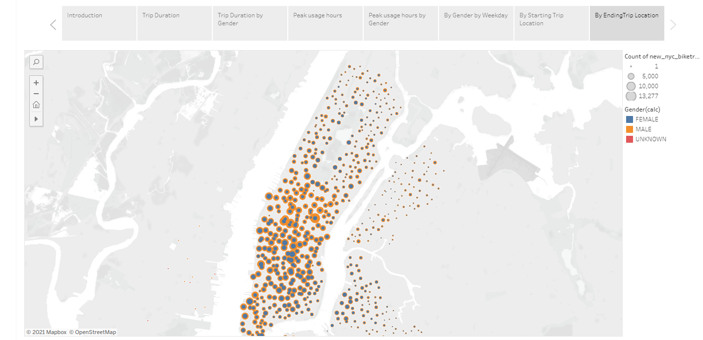

# bikesharing
## Overview of Project

https://public.tableau.com/profile/jose.santos4967#!/vizhome/Module14Challenge_16205284163930/Bike_Sharing?publish=yes

.

### Purpose

The purpose of this analysis was to demonstrate that based on NYC bike sharing data, a similar business in Des Moines would likely succeed.

## Results

### Trip Duration

A plot of the number of bike trips taken versus trip duration, shows that the majority of the trips are short:  Almost all are shorter than 60 minutes, and the most typical duration is less than 10 minutes:

A plot descriminating the trip duration by gender of the rider shows that 
1. Every gender uses bike sharing.
2. The number of male riders is ~ 3x that of female riders.
3. The distribution of the trip duration does not change signicantly depending on the gender of the rider.

A plot that shows the number of bikes shared per starting and ending time per weekday shows that there are clear peak usage times:
1. From Monday to Friday the peak hours are 7 to 9 AM and 4 to 7 PM.
2. During the weekends,the peak hours are between 9 AM and 6 PM - and there appear to be more people riding the bikes on Saturday than Sunday.

A plot that breaks down day usage by gender and per customer type (subscriber versus non-subscriber) shows that:
1) The number of male and female subscriber users is significantly larger than those users that are non-subscribers.
2) The number of unknown gender riders that are non-subscribers is larger than those that subscribe the service.
3) There is no clear prefered work week day to rent a bike for non-subscribers of all genders - usage is low on all days.
4) The preference to rent bikes during the workweek is stronger among males than females - Thursday being a peak day for male subscriber usage.

When the start and ending ride times are plotted by gender per weekday, it is clear that there are peak usage times and days for female and male riders but not by those with gender unknown:
1. Males and females peak weekday ride hours are between 7AM to 9AM and 4 to 7PM.
2. On the weekends, all genders share the same peak usage hours between 9 AM and 7 PM.

Plotting the start location of a bike ride by gender on the map of New York city shows that there are "hotspots" to pick up a bike and start riding.

Interestingly, the preference for the starting location is not perfectly aligned by gender: in some starting locations the number of female and male riders is almost the same while in others there is a clear preference for male riders.  

The preferred starting location for those of "unknown" gender can not be deciphered likely due to the small number of uknown gender riders compared to male and female riders. 

Plotting the end location of a bike ride by gender on the map of New York city shows that there are "hotspots" to drop off a bike.

As observed for the preferred locations to pick up a bike, the preference for the ending location is not perfectly aligned by gender: in some locations the number of female and male riders is almost the same while in others there is a clear preference for male riders.  

Unlike in the plot for the starting locations, there appear to be favorite spots to drop off a bike on the west side of the city, across the river Hudson.

## Summary

### Drawbacks of current webpage
One drawback of the current design of this webpage is that it does not have a reset button to remove all filters and show the initial unfiltered table.

### Suggested Additional developments
The following additional developments would really help to improve the user interface:
1. The implementation of a reset button that when pressed would remove all the filters AND show the unfiltered data again.
2. Whenever the sighting had a photograph, it would be great to be able to add it so that viewers could see it.
